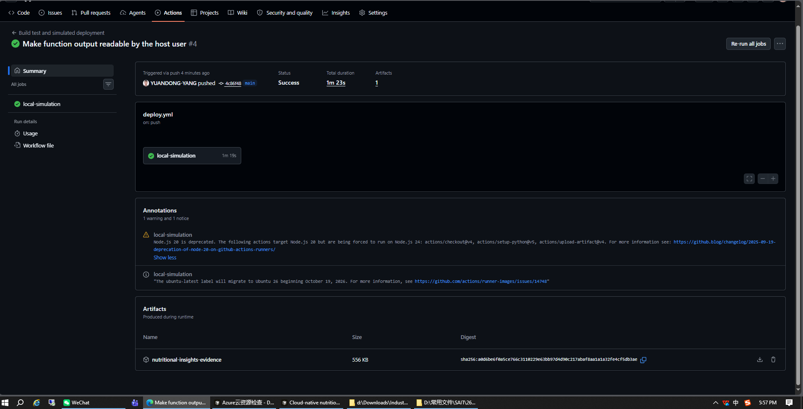
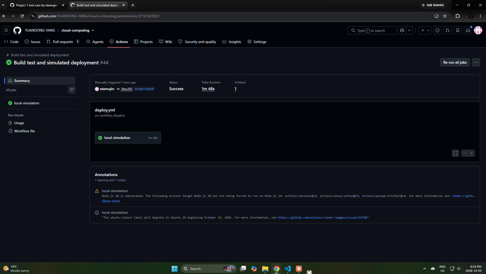
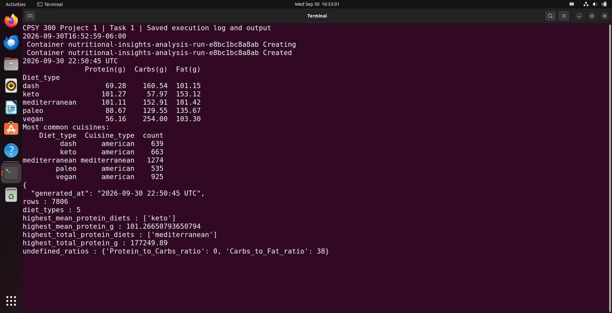
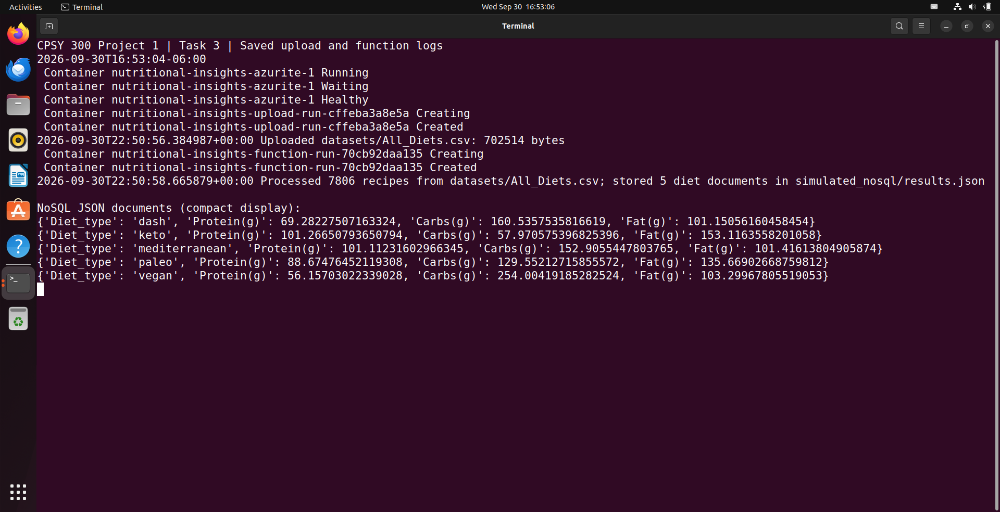
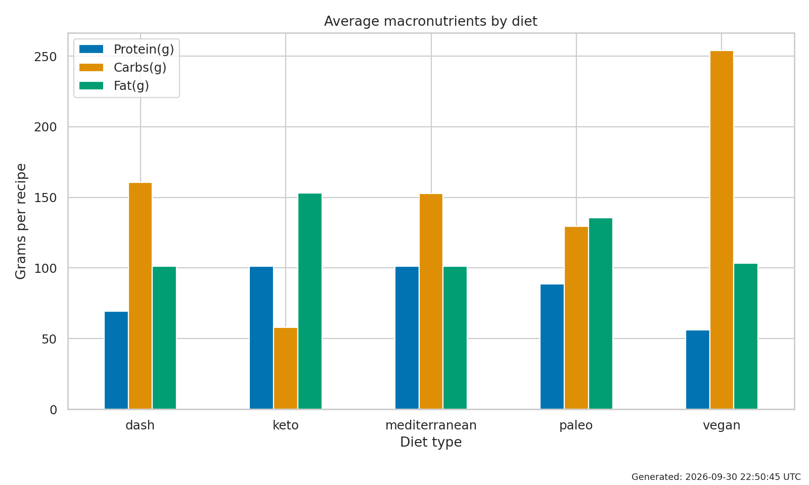
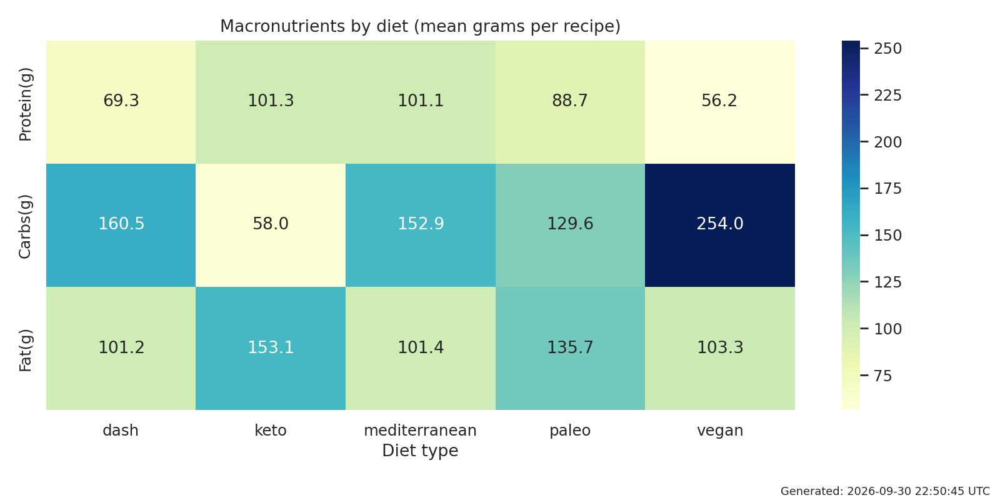
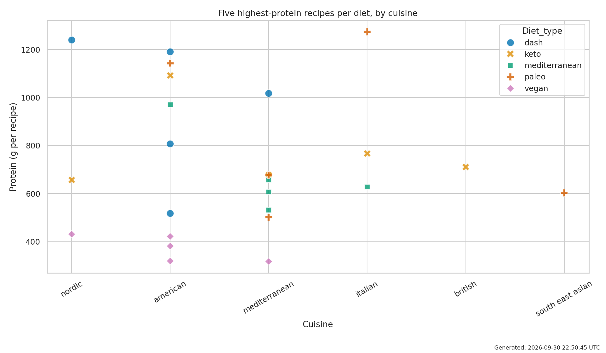

# Project 1 — Cloud-Native Nutritional Insights

Local cloud-native simulation for CPSY 300. A Pandas analysis runs in Docker; the same
dataset is uploaded to an Azurite Blob emulator and processed by a manually invoked
serverless-style Python function that stores its result as JSON documents (simulated
NoSQL). GitHub Actions builds, tests and exercises the whole flow. No real Azure
resources are used.

```
All_Diets.csv
  |-- data_analysis.py ---> output/  (tables, 3 charts, summary.json)
  `-- upload_dataset.py --> Azurite Blob "datasets"
                              `-- lambda_function.py (manual) --> simulated_nosql/results.json
Shared cleaning and aggregation: nutrition.py (batch and function must agree)
```

## Team

Yuandong Yang, Ethan Bayarsaikhan, Justin Norman-Rance. Repository: https://github.com/YUANDONG-YANG/cloud-computing (project folder `Project1`).
Per-member contributions, hours and meetings are recorded in [`docs/reports/Contribution-Report.html`](docs/reports/Contribution-Report.html).

## Assignment overview

Full illustrated overview (all tasks, screenshots, source code, logs and results embedded in one file):
[`docs/reports/Project1-Master-Overview.html`](docs/reports/Project1-Master-Overview.html).
GitHub shows HTML as source, so open it through the
[browser preview](https://htmlpreview.github.io/?https://github.com/YUANDONG-YANG/cloud-computing/blob/main/Project1/docs/reports/Project1-Master-Overview.html)
or download the file and open it locally.

| Task | Requirement | Status | Evidence |
|------|-------------|--------|----------|
| 1 (20) | Pandas analysis, ratios, cleaning, bar chart, heatmap, scatter | Done | [`docs/results/`](docs/results/), [`docs/evidence/task1-analysis.png`](docs/evidence/task1-analysis.png) |
| 2 (20) | Dockerfile, build and run, registry push, Compose | Done (local registry; Docker Hub not used) | [`docs/evidence/task2-registry.png`](docs/evidence/task2-registry.png) |
| 3 (20) | Azurite Blob upload, function, simulated NoSQL | Done (CSV uploaded by script, not Storage Explorer) | [`docs/evidence/task3-azurite.png`](docs/evidence/task3-azurite.png) |
| 4 (20) | GitHub Actions build, test, registry push | Done, runs #4 and #44 green | [`docs/evidence/github-actions-run-44.png`](docs/evidence/github-actions-run-44.png) |
| 5 (5) | Two enhancements, one-page report | Done | [`docs/reports/Enhancement-Report.pdf`](docs/reports/Enhancement-Report.pdf) |
| Video (10) | Team presentation | Pending | [`docs/reports/Video-Guide.html`](docs/reports/Video-Guide.html) |
| Contribution (5) | Per-member contributions | Pending | [`docs/reports/Contribution-Report.html`](docs/reports/Contribution-Report.html) |

### Evidence

GitHub Actions run #4 (workflow "Build test and simulated deployment", status Success, 1m 23s):



GitHub Actions run #44 (manually triggered 2026-10-03, status Success, 1m 48s, taskbar date and time visible):



Task 1 analysis run, Task 3 Azurite and function run (virtual machine, clock visible):




Charts: 



## Repository layout

| Path | Purpose |
|------|---------|
| `data_analysis.py` | Task 1: analysis, ratios, charts |
| `lambda_function.py` | Task 3: function reading from Azurite, writing JSON |
| `nutrition.py` | Shared cleaning and aggregation logic |
| `upload_dataset.py`, `storage_config.py` | Azurite upload; local-only endpoint guard |
| `Dockerfile`, `docker-compose.yml` | Task 2: multi-stage image, Compose services |
| `Dockerfile.baseline`, `Dockerfile.test`, `scripts/benchmark.py` | Task 5: size and speed comparison, test image |
| `tests/`, `scripts/verify_outputs.py`, `pytest.ini`, `.flake8` | Task 4: tests, lint, batch-vs-Blob check |
| `../.github/workflows/deploy.yml` | Task 4: CI pipeline (repository root) |
| `data/` | Course dataset (see `data/README.md`) |
| `docs/results/` | Sample results and the three charts |
| `docs/evidence/` | Logs, benchmark data and timestamped screenshots |
| `docs/reports/` | Master overview, presentation, enhancement report, video guide, contribution report |

`output/`, `evidence/` and `simulated_nosql/*.json` are generated at run time and ignored by Git.

## Run with Docker (Ubuntu VM)

```bash
cd Project1
mkdir -p output simulated_nosql evidence
docker build -t diet-analysis:project1 .
docker compose run --rm analysis
docker compose up -d --wait azurite
docker compose run --rm upload
docker compose run --rm --no-deps function
```

The image runs as UID 1000; on another UID make `output` and `simulated_nosql` writable
or pass `--user "$(id -u):$(id -g)"`. Inside Compose the Azurite host is `azurite`
(`AZURITE_HOST`); from the host it is `127.0.0.1`. The account key in
`storage_config.py` is Microsoft's public emulator key. The function is a manual
invocation, not an Azure Functions host or event trigger.

## Local Python alternative

```bash
python3 -m venv .venv && source .venv/bin/activate
pip install -r requirements-dev.txt
python data_analysis.py --csv data/All_Diets.csv
pytest -q && flake8 .
```

## Tests and benchmark in containers

```bash
docker build -f Dockerfile.test -t diet-analysis:tests .
docker run --rm -v "$PWD:/app" diet-analysis:tests python -m pytest -q
docker run --rm -v "$PWD:/app" diet-analysis:project1 python scripts/verify_outputs.py
docker run --rm -v "$PWD:/app" diet-analysis:project1 python scripts/benchmark.py
docker build -f Dockerfile.baseline -t diet-analysis:baseline .
```

## Local registry demonstration

```bash
docker compose --profile registry up -d registry
docker tag diet-analysis:project1 localhost:5001/diet-analysis:project1
docker push localhost:5001/diet-analysis:project1
docker pull localhost:5001/diet-analysis:project1
docker compose --profile registry down
```

## Key results (recipe-level values)

- Highest mean protein: keto, 101.27 g. Highest total protein: mediterranean, 177,249.89 g.
- Image size 697.66 MB to 568.16 MB (-18.6 %), mostly by excluding the full base image and pip cache.
- Aggregation 13.72 ms to 1.25 ms (11.0x) on 7,806 rows; 7.6x on a 20x replicated stress workload.

## Analysis decisions

- Trim and case-normalise diet and cuisine labels; missing labels become `unknown`.
- Non-numeric, missing, negative and infinite macro values take the column mean.
- Zero-denominator ratios stay undefined (blank in CSV), never infinity.
- Top five per diet by protein, stable ties; cuisine mode keeps every tied winner.
- Averages are per recipe, not per serving; no medical conclusions are drawn.

## CI/CD

`.github/workflows/deploy.yml` (repository root, `working-directory: Project1`) builds the
image, runs pytest and flake8, runs the analysis and Azurite flow in Compose, verifies that
both paths agree, pushes and pulls a local-registry image and runs it, and uploads evidence
artifacts. Optional Docker Hub publishing uses the repository variable
`DOCKERHUB_USERNAME` and the secret `DOCKERHUB_TOKEN`. Project 2's tests run in a separate
workflow (`.github/workflows/project2-tests.yml`), so a Project 1 run contains only the
`local-simulation` job.

## References

- Azurite default account: https://github.com/Azure/Azurite#default-storage-account
- Docker multi-stage builds: https://docs.docker.com/build/building/multi-stage/
- Pandas GroupBy: https://pandas.pydata.org/docs/user_guide/groupby.html
