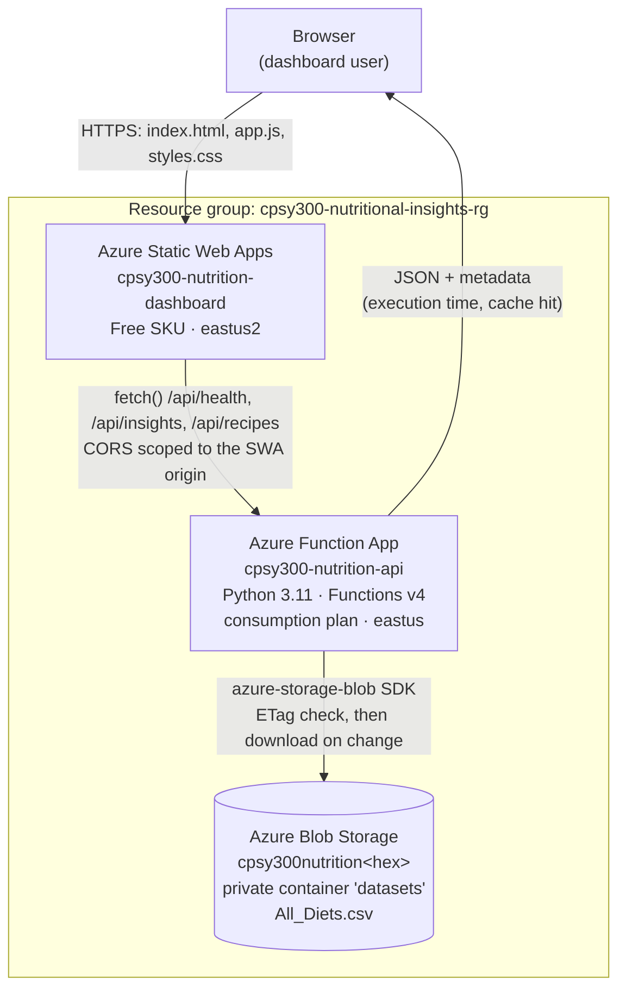

# Nutritional Insights Cloud Dashboard

## Phase 2 -- Cloud Dashboard Development: Architecture, Services and Deployment Documentation

**Course:** CPSY 300 -- Cloud Computing
**Phase:** Project Phase 2 -- Cloud Dashboard Development
**Team:** Yuandong Yang, Ethan Bayarsaikhan, Justin Norman-Rance
**Date:** 2026-10-02
**Repository:** https://github.com/YUANDONG-YANG/cloud-computing/tree/main/Project2
**Dataset:** `All_Diets.csv` -- 7,806 recipes across 5 diet types

> **Deployment status at the time of writing: NOT YET PROVISIONED.**
> The application code, the deployment script and the test suite are complete, but no
> Azure resources have been created. There are therefore **no live URLs, no measured
> response times and no screenshots** in this document. Every item that depends on a
> real deployment is marked **PENDING** and left as a labelled placeholder for a human
> to fill in after running `./deploy.sh`. Nothing in this document should be read as
> evidence of a deployment that has happened.

---

## 1. Overview

Phase 1 of this project built a local, containerised batch pipeline that cleaned the
`All_Diets.csv` recipe dataset from a local Azurite blob emulator and produced
aggregate nutritional insights and charts as files.

Phase 2 moves that solution into Azure and puts a browser dashboard in front of it.
The same cleaning and aggregation code now runs inside an HTTP-triggered **Azure
Function**, reading the dataset from a private **Azure Blob Storage** container and
returning JSON. A static dashboard hosted on **Azure Static Web Apps** calls that
Function and renders four visualizations, interaction controls and paginated tables.

| Component | Phase 1 (local) | Phase 2 (cloud) |
|-----------|-----------------|-----------------|
| Compute | Azure Functions Core Tools on localhost | Azure Function App, Linux consumption plan |
| Storage | Azurite emulator | Azure Blob Storage, private container |
| Dataset access | Local blob container | Private container, connection string from app settings |
| Output | Console logs, CSV and PNG files | JSON API consumed by a browser dashboard |
| Hosting | None | Azure Static Web Apps |

---

## 2. Architecture

### 2.1 Diagram

```
                        +---------------------------------+
                        |          End user               |
                        |   Browser (desktop / mobile)    |
                        +----------------+----------------+
                                         |
                              HTTPS GET (static assets)
                                         |
                                         v
            +----------------------------------------------------------+
            |            Azure Static Web Apps  (Free SKU)             |
            |                cpsy300-nutrition-dashboard               |
            |                      region: eastus2                     |
            |                                                          |
            |   index.html  |  app.js  |  styles.css                   |
            |   staticwebapp.config.json                               |
            |   API base URL injected at build time                    |
            +----------------------------+-----------------------------+
                                         |
                      cross-origin HTTPS fetch() to /api/*
                      (CORS allows only the SWA origin)
                                         |
                                         v
            +----------------------------------------------------------+
            |              Azure Function App (HTTP trigger)           |
            |                  cpsy300-nutrition-api                   |
            |      Python 3.11  |  Functions v4  |  consumption plan   |
            |                      region: eastus                      |
            |                                                          |
            |   GET /api/health     liveness, no storage call          |
            |   GET /api/insights   aggregates                         |
            |   GET /api/recipes    paginated rows                     |
            |                                                          |
            |   in-memory DataFrame cache, keyed by blob ETag          |
            +----------------------------+-----------------------------+
                                         |
                 azure-storage-blob SDK, connection string read from
                 app setting AZURE_STORAGE_CONNECTION_STRING
                                         |
                                         v
            +----------------------------------------------------------+
            |                   Azure Blob Storage                     |
            |            cpsy300nutrition<random-hex>                  |
            |        StorageV2 | Standard_LRS | TLS 1.2 minimum        |
            |          public blob access disabled | eastus            |
            |                                                          |
            |     container "datasets" (PRIVATE)                       |
            |        └── All_Diets.csv   (7,806 recipes)               |
            +----------------------------------------------------------+

        All resources live in one resource group:
        cpsy300-nutritional-insights-rg   (eastus; the Static Web App is in
        eastus2 because Static Web Apps is not offered in eastus)
```

### 2.2 Mermaid equivalent



### 2.3 Why this shape

- **Serverless compute.** The workload is bursty and read-only, so a consumption-plan
  Function App costs nothing while idle and needs no VM or container to maintain.
- **Separation of hosting and compute.** Static assets are served by a CDN-backed
  static host; only data requests reach the Function. The dashboard stays fast and
  the Function scales independently.
- **Private storage, no public blob URL.** The browser never talks to Blob Storage.
  The Function is the only reader, and it authenticates with a connection string held
  in app settings, so the container can stay private.
- **Stateless Function, cached dataset.** No database is needed: the cleaned
  DataFrame is cached in worker memory and invalidated by the blob's ETag.

---

## 3. Azure Services Used

| Service | Resource name | Configuration | Why it is used |
|---------|---------------|---------------|----------------|
| **Resource Group** | `cpsy300-nutritional-insights-rg` | Region `eastus` | One logical container for every resource in the project, so the whole environment can be deployed, audited and deleted as a unit. |
| **Azure Storage Account** | `cpsy300nutrition<random-hex>` | `StorageV2`, `Standard_LRS`, `--min-tls-version TLS1_2`, `--allow-blob-public-access false`, region `eastus` | Durable, cheap object store for the dataset. Storage account names are globally unique, hence the random suffix; a matching account already present in the group is reused on re-runs. Also backs the Function App's own `AzureWebJobsStorage` requirement. |
| **Azure Blob Storage container** | `datasets` (private) | Holds `All_Diets.csv` | Keeps the raw dataset out of the repository and out of the deployment package, so the data can be replaced without redeploying code. Private access means no anonymous URL exists. |
| **Azure Function App** | `cpsy300-nutrition-api` | Python **3.11**, Functions runtime **v4**, Linux **consumption plan**, Python v2 programming model, anonymous HTTP auth, region `eastus` | Serverless HTTP API. Runs the Project 1 cleaning and aggregation code on demand and returns JSON. Consumption plan means pay-per-execution and automatic scale-out. |
| **Azure Static Web Apps** | `cpsy300-nutrition-dashboard` | **Free** SKU, region `eastus2`, created **unlinked** (no GitHub repository attached), deployed with a deployment token via the `swa` CLI | Public hosting for the dashboard with HTTPS and a default hostname included. Created unlinked so no GitHub token or workflow is required. `eastus2` because Static Web Apps is not available in `eastus`. |
| **Function App application settings** | `AZURE_STORAGE_CONNECTION_STRING`, `BLOB_CONTAINER_NAME`, `BLOB_NAME` | Set by `deploy.sh` | Externalises all configuration and the one secret. Nothing environment-specific is hard-coded, and the connection string never enters the repository. |
| **Function App CORS configuration** | host-level allowed origins | Scoped to the Static Web App origin only | Lets the dashboard call the API from its own origin without opening the API to every website. |
| **Application Insights** | provisioned with the Function App | Sampling enabled in `host.json`, `Request` type excluded | Captures the Function's logs and exceptions, which is where internal error detail goes instead of into HTTP responses. |

---

## 4. Data Flow for One Request, End to End

Example: the user opens the dashboard and the page loads its first data.

1. **Static assets.** The browser requests the dashboard from the Static Web App and
   receives `index.html`, `app.js` and `styles.css` over HTTPS.
2. **Endpoint resolution.** An inline script in `index.html` sets
   `window.NUTRITIONAL_API_URL`. In a deployed build this value was substituted for
   the `__FUNCTION_API_URL__` placeholder by `deploy.sh`; if the placeholder is still
   present (a local, unbuilt copy) the script deletes the variable and `app.js` falls
   back to the same-origin `/api` path.
3. **Liveness probe.** `app.js` calls `GET /api/health`. The handler returns
   immediately with `status`, `service`, `version` and `dataset_cached`; it makes no
   storage call at all, so it cannot be slowed down or broken by a storage problem.
   The result drives the header status pill.
4. **Aggregates request.** `app.js` calls `GET /api/insights`.
5. **Cache check inside the Function.** `_load_dataset()` constructs a
   `BlobServiceClient` from `AZURE_STORAGE_CONNECTION_STRING` and issues one cheap
   `get_blob_properties()` call to read the blob's current **ETag**.
   - **ETag unchanged and a frame is cached:** the cached DataFrame is returned and
     the response reports `metadata.dataset_from_cache = true`. No CSV download.
   - **ETag changed, or nothing cached (cold start):** the blob is downloaded,
     `clean_data()` runs, the result is stored in the cache under the new ETag, and
     the response reports `dataset_from_cache = false`. A lock guards the cache
     because one worker handles requests concurrently.
6. **Aggregation.** The handler computes average macros per diet, the top 5
   highest-protein recipes per diet, the most common cuisine per diet (ties
   preserved), total protein per diet, recipe counts per diet, and the summary
   statistics.
7. **Response.** The aggregates are serialised to JSON with
   `metadata.execution_time_seconds`, `source`, `dataset` and `dataset_from_cache`.
   Because host-level CORS is configured, Azure adds the single
   `Access-Control-Allow-Origin` header; the function code adds none.
8. **Page request.** `app.js` calls
   `GET /api/recipes?page=1&limit=50` (plus `diet_type` when a diet is selected). The
   handler validates the pagination parameters, applies the diet filter, computes
   `total` and `total_pages`, clamps an out-of-range page to the last page, and slices
   exactly that page out of the DataFrame.
9. **Render.** `app.js` draws the four visualizations, fills the stat tiles and the
   two summary tables, renders the 50-row recipe page with its pagination controls,
   and displays the execution time reported by `/api/insights`.
10. **Subsequent paging.** Clicking a page number issues a **new**
    `/api/recipes` request for that page. Nothing is sliced client-side while the API
    is reachable.
11. **Failure path.** If `/api/insights` or `/api/recipes` fails, the dashboard
    switches the **entire** view to offline mode: a prominent banner states that the
    figures come from the committed Project 1 batch results rather than live cloud
    data and names the unreachable endpoint. Live and fallback data are never mixed
    in one view.

---

## 5. API Reference

Base URL (once `deploy.sh` has run -- **not yet provisioned**, see section 1):
`https://cpsy300-nutrition-api.azurewebsites.net/api`
(the route prefix `api` is set in `backend/host.json`)

All endpoints are `GET`, anonymous, and return `application/json`.

| Endpoint | Query parameters | Returns |
|----------|------------------|---------|
| `/api/health` | -- | `status`, `service`, `version`, `dataset_cached`. Makes no storage call. |
| `/api/insights` | -- | `average_macros`, `top_recipes`, `common_cuisines`, `total_protein_by_diet`, `summary`, `metadata`. |
| `/api/recipes` | `diet_type` (one diet, or `all`/omitted for every diet), `page` (1-based, default `1`), `limit` (default `50`, hard cap `500`) | `recipes`, `count`, `total`, `page`, `limit`, `total_pages`, `diet_type_filter`, `metadata`. |

**Error behaviour**

| Condition | Status | Body |
|-----------|--------|------|
| `page` or `limit` not a positive integer | `400` | `{"error": "Invalid pagination parameter: ..."}` |
| `diet_type` matches no recipes | `404` | `{"error": "No recipes found for diet type: ..."}` |
| Unexpected failure | `500` | A generic message. The exception is logged to Application Insights and never returned, so storage details cannot leak to the browser. |

**`metadata` block** (present on `/api/insights` and `/api/recipes`)

| Field | Meaning |
|-------|---------|
| `execution_time_seconds` | Server-side handler duration. Satisfies the rubric's "show metadata such as function execution time". |
| `source` | `"Azure Blob Storage"` |
| `dataset` | The blob name, from the `BLOB_NAME` app setting |
| `dataset_from_cache` | `true` when the cached DataFrame was reused, `false` when the CSV was re-downloaded and re-cleaned |

**Sample response shapes** are given in `../README.md`, with real dataset values. The
`execution_time_seconds` figures there are illustrative placeholders, because nothing
has been deployed and so no timings have been measured.

### Pagination rationale

The unpaged payload for all 7,806 rows is approximately **1.21 MB**. Shipping that on
every load, and again on every filter change, is wasteful on a consumption plan and
slow on a mobile connection, so `/api/recipes` pages server-side with a default of 50
rows and a hard cap of 500.

---

## 6. Methodology: Cleaning and Aggregation

`backend/nutrition.py` is shared with Project 1 unchanged in behaviour, so the cloud
API and the Phase 1 batch pipeline produce identical numbers.

### 6.1 Cleaning (`clean_data`)

1. **Column names** are stripped of surrounding whitespace.
2. **Schema validation.** The required columns are `Diet_type`, `Recipe_name`,
   `Cuisine_type`, `Protein(g)`, `Carbs(g)`, `Fat(g)`. A missing column raises
   immediately with the names listed; an empty dataset is also rejected. Failing loudly
   is deliberate -- silently analysing a malformed file is worse than returning an error.
3. **Categorical text.** `Diet_type` and `Cuisine_type` are stripped and case-folded,
   so `"Keto"`, `"keto "` and `"KETO"` collapse to one group. Empty values become
   `"unknown"` rather than being dropped.
4. **Recipe names** are stripped; empty names become `"Unnamed recipe"`.
5. **Numeric macros.** Each macro column is coerced to numeric; non-finite and
   negative values are treated as missing, then imputed with the **column mean**. The
   count of imputed values per column is recorded in `df.attrs["imputed_values"]`. If
   a macro column has no valid value at all, the run fails rather than inventing data.
6. **Derived ratios.** `Protein_to_Carbs_ratio` and `Carbs_to_Fat_ratio` are computed
   with zero denominators mapped to `NaN` (not to infinity). These columns are
   deliberately **excluded from every API response**, which is why responses can be
   serialised with `allow_nan=False` and still never emit invalid JSON.

The cleaning is deterministic: the same input CSV always yields the same output, which
is what makes the cached DataFrame and the ETag invalidation safe.

### 6.2 Aggregation

| Aggregate | How it is computed |
|-----------|--------------------|
| `average_macros` | `groupby("Diet_type").mean()` over the three macro columns, rounded to 2 decimals in the response |
| `top_recipes` | Stable sort by `Protein(g)` descending, then `head(5)` per diet -- stable so ties are reproducible |
| `common_cuisines` | Count per `(Diet_type, Cuisine_type)`, keep every row equal to that diet's maximum, so **ties are preserved** rather than arbitrarily broken |
| `total_protein_by_diet` | `groupby("Diet_type")["Protein(g)"].sum()` |
| `summary.diet_counts` | `value_counts()` on `Diet_type` |
| `summary.highest_mean_protein_*` | `idxmax()` / `max()` over the mean protein series |
| `summary.highest_total_protein_*` | `idxmax()` / `max()` over the total protein series |

---

## 7. Key Findings

**Dataset:** `All_Diets.csv` -- **7,806** recipes, **5** diet types.

### 7.1 Average macronutrients per diet (grams per recipe)

| Diet | Avg Protein (g) | Avg Carbs (g) | Avg Fat (g) |
|------|-----------------|---------------|-------------|
| dash | 69.28 | 160.54 | 101.15 |
| keto | 101.27 | 57.97 | 153.12 |
| mediterranean | 101.11 | 152.91 | 101.42 |
| paleo | 88.67 | 129.55 | 135.67 |
| vegan | 56.16 | 254.00 | 103.30 |

The two extremes are exactly what the diets prescribe: **keto** has the lowest carbs
(57.97 g) and the highest fat (153.12 g), while **vegan** has the highest carbs
(254.00 g) and the lowest protein (56.16 g).

### 7.2 Recipe distribution

| Diet | Recipes | Share |
|------|---------|-------|
| mediterranean | 1,753 | 22.5% |
| dash | 1,745 | 22.4% |
| vegan | 1,522 | 19.5% |
| keto | 1,512 | 19.4% |
| paleo | 1,274 | 16.3% |

The dataset is reasonably balanced: **mediterranean** is the largest group at 22.5%
and **paleo** the smallest at 16.3%, a spread of only about six percentage points.

### 7.3 Total protein per diet

| Diet | Total Protein (g) |
|------|-------------------|
| mediterranean | 177,249.89 |
| keto | 153,114.96 |
| dash | 120,897.57 |
| paleo | 112,971.65 |
| vegan | 85,471.00 |

- **Highest mean protein: keto, 101.27 g per recipe.**
- **Highest total protein: mediterranean, 177,249.89 g.**

These two headline figures disagree, and that is the interesting part: keto has the
highest protein *per recipe*, but mediterranean has more recipes (1,753 vs 1,512) and
a nearly identical mean (101.11 g), so it accumulates the largest total. Per-recipe
and whole-corpus views answer different questions.

### 7.4 Most common cuisine per diet

| Diet | Cuisine | Count |
|------|---------|-------|
| dash | american | 639 |
| keto | american | 663 |
| mediterranean | mediterranean | 1,274 |
| paleo | american | 535 |
| vegan | american | 925 |

`american` dominates four of the five diets. **mediterranean** is the exception and by
a wide margin: 1,274 of its 1,753 recipes (about 73%) are also tagged `mediterranean`
cuisine, so diet and cuisine are effectively the same label for that group.

### 7.5 Macronutrient correlations

| Pair | Correlation |
|------|-------------|
| Protein-Carbs | **+0.156** |
| Carbs-Fat | **+0.269** |
| Protein-Fat | **+0.478** |

All three correlations are **positive**. The dominant effect is simply recipe size:
larger recipes contain more of everything, which is why protein and fat move together
most strongly (+0.478). The diet-specific trade-offs visible in section 7.1 appear
*between* diet groups, not within the pooled row-level data.

---

## 8. Cloud Practices

| Practice | How it is implemented |
|----------|-----------------------|
| **Single resource group** | Every resource is created in `cpsy300-nutritional-insights-rg`, so the environment can be deployed, reviewed and torn down as one unit. |
| **Configuration in app settings** | `AZURE_STORAGE_CONNECTION_STRING`, `BLOB_CONTAINER_NAME` and `BLOB_NAME` are Function App settings read via `os.environ`. No endpoint, container or credential is hard-coded in the source. |
| **Private blob container** | The `datasets` container is created private, and the storage account is created with `--allow-blob-public-access false`. The dataset has no anonymous URL; the Function App is the only reader. |
| **TLS 1.2 minimum** | The storage account is created with `--min-tls-version TLS1_2`. All browser and SDK traffic is HTTPS. |
| **Scoped CORS** | `deploy.sh` removes any wildcard origin and allows only the Static Web App origin at the **Function App host level**. The function code emits no `Access-Control-Allow-*` headers at all -- deliberately, because host-level CORS plus handler-written CORS produces duplicate `Access-Control-Allow-Origin` headers, which browsers reject. Exactly one layer owns CORS. |
| **No secrets in the repository** | `backend/local.settings.json` is git-ignored; `backend/local.settings.json.example` is the committed template. No connection string, storage key or publish profile is committed. `deploy.sh` writes the connection string straight into the Function App settings and **never prints it**, so it cannot leak into terminal scrollback, a screenshot or a screen recording; the script prints the `az` command to retrieve it instead. |
| **Least-privilege error reporting** | Handlers log exceptions to Application Insights and return a generic message, so storage paths and credentials cannot leak through an HTTP error body. |
| **Idempotent, parameterised deployment** | `deploy.sh` can be re-run safely, reuses an existing storage account in the group instead of creating a second one, and takes every name, region and runtime version from an overridable environment variable. |
| **Efficient data access** | The cleaned DataFrame is cached in worker memory keyed by the blob **ETag**, so each request costs one metadata call instead of a 1.2 MB download plus a re-clean. `/api/recipes` pages server-side (default 50, cap 500) instead of returning the full 1.21 MB payload. `/api/health` touches no storage. |
| **Automated tests** | A pytest suite under `Project2/tests/` covers the backend. Run it with `pip install -r requirements-dev.txt` then `python -m pytest -q` from `Project2`. |

---

## 9. Screenshots

> **ALL SCREENSHOTS BELOW ARE PENDING.** They require a provisioned Azure environment,
> which does not exist yet. Each placeholder states exactly what to capture. **Every
> screenshot must show the current date and time** -- either the operating system
> clock in the taskbar/menu bar, or a visible timestamp inside the Azure portal blade
> -- so that the capture can be dated. Do not crop the clock out. Save the images into
> `docs/screenshots/` and replace the placeholder block with the image and its caption.

### Figure 1 -- Azure portal: resource group overview

> **[PENDING SCREENSHOT]**
> **Capture:** the Azure portal **Overview** blade for the resource group
> `cpsy300-nutritional-insights-rg`, with the resource list visible, showing the
> storage account, the Function App, its App Service plan, Application Insights and
> the Static Web App, together with their types and regions.
> **Must show:** the resource group name, every resource in it, and the date/time
> (system clock or portal timestamp).

### Figure 2 -- Azure portal: Function App overview

> **[PENDING SCREENSHOT]**
> **Capture:** the **Overview** blade of the Function App `cpsy300-nutrition-api`,
> showing Status = Running, the default domain
> (`cpsy300-nutrition-api.azurewebsites.net`), the runtime stack (Python 3.11), the
> App Service plan (consumption), and the region.
> **Optional second capture:** the **Functions** list showing the three functions
> `health`, `insights` and `recipes`, and the **Configuration** blade showing the
> three app setting **names** with their values hidden -- do **not** reveal
> `AZURE_STORAGE_CONNECTION_STRING`.
> **Must show:** the Function App name, Running status, and the date/time.

### Figure 3 -- Azure portal: Storage container with the dataset blob

> **[PENDING SCREENSHOT]**
> **Capture:** the **Containers** view of the storage account
> `cpsy300nutrition<random-hex>`, with the `datasets` container open, showing
> `All_Diets.csv` with its size and last-modified timestamp, and the container's
> public access level shown as **Private**.
> **Must show:** the container name, the blob, the Private access level, and the
> date/time.

### Figure 4 -- Azure portal: Static Web App overview

> **[PENDING SCREENSHOT]**
> **Capture:** the **Overview** blade of the Static Web App
> `cpsy300-nutrition-dashboard`, showing the default hostname (the public dashboard
> URL), the Free SKU, and the region `eastus2`.
> **Must show:** the Static Web App name, its URL, and the date/time.

### Figure 5 -- Browser: the live dashboard

> **[PENDING SCREENSHOT]**
> **Capture:** a browser at the Static Web App URL with the dashboard fully loaded.
> The **green "API Connected" pill** and the **execution-time badge** must be visible,
> and the **offline banner must NOT be showing** -- that is the proof the page is
> rendering live cloud data rather than the Project 1 fallback. Include the four
> charts, the stat tiles and at least one table.
> **Must show:** the full Static Web App URL in the address bar, the "API Connected"
> status, and the date/time.
> **Recommended second capture:** the same page with a diet filter applied and a
> later page of the recipe table selected, with the browser devtools Network tab open
> showing the resulting `/api/recipes?...&page=N` request -- this demonstrates that the
> pagination is genuinely server-side.

### Figure 6 -- `/api/health` response

> **[PENDING SCREENSHOT]**
> **Capture:** Postman or a browser tab showing
> `https://cpsy300-nutrition-api.azurewebsites.net/api/health` with the JSON response
> body and the `200 OK` status.
> **Must show:** the full request URL, the status code, the response body, and the
> date/time.

### Figure 7 -- `/api/insights` response

> **[PENDING SCREENSHOT]**
> **Capture:** Postman or a browser tab showing
> `https://cpsy300-nutrition-api.azurewebsites.net/api/insights`, with the response
> body scrolled so that the `summary` and `metadata` blocks are both readable --
> `total_recipes: 7806` and `metadata.execution_time_seconds` are the figures worth
> having in frame.
> **Must show:** the full request URL, the status code, the `summary` and `metadata`
> blocks, and the date/time.

### Figure 8 -- `/api/recipes` response with query parameters

> **[PENDING SCREENSHOT]**
> **Capture:** Postman or a browser tab showing
> `https://cpsy300-nutrition-api.azurewebsites.net/api/recipes?diet_type=keto&page=2&limit=50`,
> with `count`, `total`, `page`, `limit` and `total_pages` visible in the response.
> **Must show:** the full request URL including the query string, the status code, the
> pagination fields, and the date/time.

### Figure 9 -- Test suite run (optional, no Azure needed)

> **[PENDING SCREENSHOT]**
> **Capture:** a terminal in `Project2` showing `python -m pytest -q` and its passing
> summary line.
> **Must show:** the command, the result, and the date/time.

---

## 10. Challenges and Solutions

### 10.1 Duplicate CORS headers

**Challenge.** With host-level CORS configured on the Function App *and* the handler
writing its own `Access-Control-Allow-Origin` header, responses carried the header
twice. Browsers reject a response with duplicate `Access-Control-Allow-Origin`
headers, so the dashboard's `fetch()` failed even though the API itself was healthy --
and because the dashboard falls back on any failure, the symptom looked like an API
outage rather than a header problem.

**Solution.** Give exactly one layer ownership of CORS, and make it the host
configuration: `deploy.sh` removes any wildcard origin and adds only the Static Web
App origin, while `backend/function_app.py` deliberately emits no `Access-Control-*`
headers at all. The module docstring records why, so the headers are not "helpfully"
added back later. Keeping CORS at the host level also means the allowed origin can be
re-scoped at deploy time without touching code.

### 10.2 A 1.21 MB response on every load

**Challenge.** `/api/recipes` originally returned all 7,806 rows -- about **1.21 MB**
of JSON -- on every page load and every filter change, while the dashboard paginated
the rows in the browser. That is slow on a mobile connection and wasteful on a
consumption plan that bills per execution time and egress.

**Solution.** Move pagination to the server. `/api/recipes` now accepts `page` and
`limit` (default 50, hard cap 500 so a client cannot request the whole dataset),
returns `total` and `total_pages` alongside the page, clamps an out-of-range page to
the last page, and the frontend issues a fresh request per page click. The typical
response is now a few tens of kilobytes.

### 10.3 Re-downloading and re-cleaning the CSV on every request

**Challenge.** Downloading and cleaning the dataset per request dominated the response
time, but caching it unconditionally meant a re-uploaded CSV would be ignored until
the worker recycled.

**Solution.** Cache the cleaned DataFrame keyed by the blob's **ETag**. Every request
makes one cheap `get_blob_properties()` call; the CSV is re-downloaded and re-cleaned
only when the ETag has changed. A lock guards the cache because one worker serves
requests concurrently, and `metadata.dataset_from_cache` exposes which path each
request took so the behaviour is observable rather than assumed.

### 10.4 The API endpoint is not known until deployment time

**Challenge.** The dashboard needs the Function App's URL, which only exists after the
Function App is created. Hard-coding it would break other environments; committing it
after the first deployment would mean a source file that changes on every deploy.

**Solution.** `frontend/index.html` ships a `__FUNCTION_API_URL__` placeholder.
`deploy.sh` copies `frontend/` into a throwaway `build/` directory, substitutes the
real URL there, verifies the substitution actually happened (and aborts if not), and
deploys only `build/`. The committed sources keep the placeholder, so the repository
stays clean. If the placeholder is ever left unreplaced, the inline script detects the
`__` prefix and falls back to a same-origin `/api` base path, which is the correct
behaviour for local development.

### 10.5 A silent fallback that looked like a working dashboard

**Challenge.** An earlier build fell back to built-in data behind a small "Demo Mode"
pill. A dashboard full of charts rendered from non-live data, with only a subtle badge
to say so, is actively misleading -- and the built-in numbers were not even the real
Project 1 output.

**Solution.** Two changes. First, the fallback data is now the **real Project 1 batch
output**, taken from the committed `Project1/docs/results/*.csv` files, so nothing on
the page is invented. Second, the fallback is unmistakable: a **prominent banner**
states that the figures are Project 1 batch results rather than live cloud data and
names the endpoint that could not be reached, and the header pill switches to
"Offline - fallback data". A failure in either data call switches the **whole** view,
so live and fallback data are never mixed. The honest failure mode is now easier to
read than the misleading one was.

### 10.6 Static Web Apps region availability

**Challenge.** `az staticwebapp create` fails in `eastus`, where the rest of the
project's resources live, because Static Web Apps is offered in only a handful of
regions.

**Solution.** Use a separate `SWA_LOCATION` (`eastus2`) for the Static Web App while
`LOCATION` (`eastus`) governs everything else. Both are overridable environment
variables, and the split is documented in the script and the README so it is not
mistaken for an inconsistency.

### 10.7 Creating a Static Web App without a GitHub token

**Challenge.** Creating a Static Web App linked to a GitHub repository requires a
GitHub personal access token with repository scope, which is an awkward and
over-privileged dependency for a course deployment -- and the failure mode when the
token is absent is easy to swallow silently.

**Solution.** Create the Static Web App **unlinked**, then deploy the built frontend
with the `swa` CLI using a deployment token read from
`az staticwebapp secrets list`. No GitHub credential is involved. The script checks
for `swa` up front; if it is missing it warns, skips only that step, and prints the
exact `swa deploy` command to run manually, so the rest of the deployment still
completes.

### 10.8 Documentation that had drifted from the code

**Challenge.** An independent audit (`review/score-review-2026-10-02.md`) found that
the project's prose described a system that had not been built: a `/api/clusters`
K-means endpoint, a search box, client-side pagination presented as server-side,
wildcard CORS presented as scoped, wrong recipe counts, inverted correlation signs,
and resource names that disagreed with `deploy.sh`. A marker comparing the write-up
against the code would find the two did not match, which costs more than an openly
incomplete submission.

**Solution.** Treat the verified audit as the source of truth and rewrite the prose
against the actual code: correct the recipe counts and correlation signs everywhere,
delete the clustering and search-box claims, document the real three endpoints and
their real parameters, align every resource name and region with `deploy.sh`, and
state the deployment status honestly instead of marking undone work as complete.

### 10.9 Outstanding: nothing is deployed

**Challenge.** The rubric awards 20 marks for deployment and 20 for integration, both
of which require real Azure resources and evidence of them. No Azure subscription has
been used yet, so no resource exists, no URL is live and no screenshot can be taken.
This cannot be resolved from the repository.

**Status: PENDING.** The remaining work is, in order: run `az login` and `./deploy.sh`
with an active subscription; confirm the smoke test reports OK for all three
endpoints; open the dashboard and confirm the green "API Connected" pill with no
offline banner; capture Figures 1-9 with the clock visible; paste the two live URLs
into this document and the README; export this document to PDF.

---

## 11. Rubric Mapping

| Category | Marks | Implementation | Status |
|----------|-------|----------------|--------|
| **Deployment (Azure Cloud)** | 20 | `deploy.sh` provisions the resource group, storage account, private `datasets` container with the uploaded CSV, the Python 3.11 consumption-plan Function App with its app settings, and the Static Web App; publishes the backend; builds and deploys the frontend; scopes CORS; and smoke-tests all three endpoints. | **PENDING** -- the script is complete and idempotent, but it has not been run against a subscription. No resources exist and there are no live URLs. |
| **Frontend Dashboard** | 20 | Responsive dashboard (`frontend/index.html`, `app.js`, `styles.css`) with a header status pill, execution-time badge, six summary stat tiles, four charts, two summary tables and a paginated recipe table. | **Code complete** -- the rubric also requires a publicly accessible deployment, which is pending. |
| **Data Visualization** | 20 | Four distinct visualizations, all driven by the API response: grouped bar (average macros), doughnut (recipe distribution), CSS-grid heatmap (macronutrient intensity), scatter (protein vs carbs). Exceeds the required three. | **Code complete.** When the API is unreachable the charts render the real committed Project 1 results behind an explicit offline banner, not invented values. |
| **Integration** | 20 | `app.js` calls `/api/health`, `/api/insights` and `/api/recipes` with `fetch()`; the endpoint is injected at build time; pagination and diet filtering are round-trips to the Function; `metadata.execution_time_seconds` is displayed; failures surface a prominent banner instead of silently substituting data. | **Code complete** -- needs a live Function App to demonstrate. |
| **Cloud Practices** | 10 | Single resource group; all configuration and the one secret in Function App settings; private container with public blob access disabled; TLS 1.2 minimum; CORS scoped to the dashboard origin at the host level only; `local.settings.json` git-ignored with a committed `.example`; the connection string never printed; ETag-keyed caching and server-side paging; pytest suite. | **Implemented in code and script.** See section 8. |
| **Documentation & Presentation** | 10 | This document (architecture diagram, service table, end-to-end data flow, API reference, methodology, findings, cloud practices, challenges), plus `../README.md` and `Phase2-Analysis.md`. | **Written.** The required screenshots (section 9) are pending, and the PDF export is pending. |

### Deliverables (course document, section 7)

| Deliverable | Status |
|-------------|--------|
| Deployed Azure Function URL | **PENDING** -- not provisioned. Will be `https://cpsy300-nutrition-api.azurewebsites.net` once `deploy.sh` has run successfully. |
| Azure Static Web App / frontend deployment link | **PENDING** -- not provisioned. The URL is the default hostname assigned to `cpsy300-nutrition-dashboard` at creation time. |
| GitHub repository with frontend and backend code | **Done** -- https://github.com/YUANDONG-YANG/cloud-computing/tree/main/Project2 |
| Documentation PDF (architecture, services, screenshots) | **IN PROGRESS** -- this file is the source. Export to PDF after Figures 1-9 have been captured. |

---

## 12. Reproducing the Deployment

```bash
# from Project2/
az login
chmod +x deploy.sh
./deploy.sh
```

Prerequisites: Azure CLI, Azure Functions Core Tools v4 (`func`), and the Static Web
Apps CLI (`npm install -g @azure/static-web-apps-cli`). The script's seven steps, the
overridable environment variables and the `eastus`/`eastus2` region split are
documented in `../README.md`.

To run the backend tests first:

```bash
pip install -r requirements-dev.txt
python -m pytest -q
```

---

## 13. Team Contributions

| Member | Contribution |
|--------|--------------|
| Yuandong Yang | *To be completed before submission.* |
| Ethan Bayarsaikhan | *To be completed before submission.* |
| Justin Norman-Rance | *To be completed before submission.* |

---

## Appendix A -- Verified Reference Figures

Every figure in this document was recomputed from `Project1/data/All_Diets.csv` and
cross-checked against the committed Project 1 results in `Project1/docs/results/`.

| Quantity | Value |
|----------|-------|
| Total recipes | 7,806 |
| Diet types | 5 (dash, keto, mediterranean, paleo, vegan) |
| Recipe counts | mediterranean 1,753 · dash 1,745 · vegan 1,522 · keto 1,512 · paleo 1,274 |
| Shares | mediterranean 22.5% · dash 22.4% · vegan 19.5% · keto 19.4% · paleo 16.3% |
| Avg macros (P/C/F g) | dash 69.28 / 160.54 / 101.15 · keto 101.27 / 57.97 / 153.12 · mediterranean 101.11 / 152.91 / 101.42 · paleo 88.67 / 129.55 / 135.67 · vegan 56.16 / 254.00 / 103.30 |
| Total protein (g) | mediterranean 177,249.89 · keto 153,114.96 · dash 120,897.57 · paleo 112,971.65 · vegan 85,471.00 |
| Most common cuisine | dash american 639 · keto american 663 · mediterranean mediterranean 1,274 · paleo american 535 · vegan american 925 |
| Highest mean protein | keto, 101.27 g |
| Highest total protein | mediterranean, 177,249.89 g |
| Macro correlations | Protein-Carbs +0.156 · Carbs-Fat +0.269 · Protein-Fat +0.478 |
| Full unpaged `/api/recipes` payload | ~1.21 MB for all 7,806 rows |

### Resource names (from `deploy.sh`)

| Resource | Name / value |
|----------|--------------|
| Resource group | `cpsy300-nutritional-insights-rg` |
| Primary region | `eastus` |
| Static Web App region | `eastus2` (Static Web Apps is not available in `eastus`) |
| Storage account | `cpsy300nutrition<random-hex>` |
| Blob container | `datasets` (private) |
| Blob name | `All_Diets.csv` |
| Function App | `cpsy300-nutrition-api` |
| Static Web App | `cpsy300-nutrition-dashboard` |
| Python version | 3.11 |
| Functions runtime | v4, Linux consumption plan |
| App settings | `AZURE_STORAGE_CONNECTION_STRING`, `BLOB_CONTAINER_NAME`, `BLOB_NAME` |

---

*End of document. Export to PDF only after the Figure 1-9 screenshots have been
captured and the two live URLs have been filled in.*
